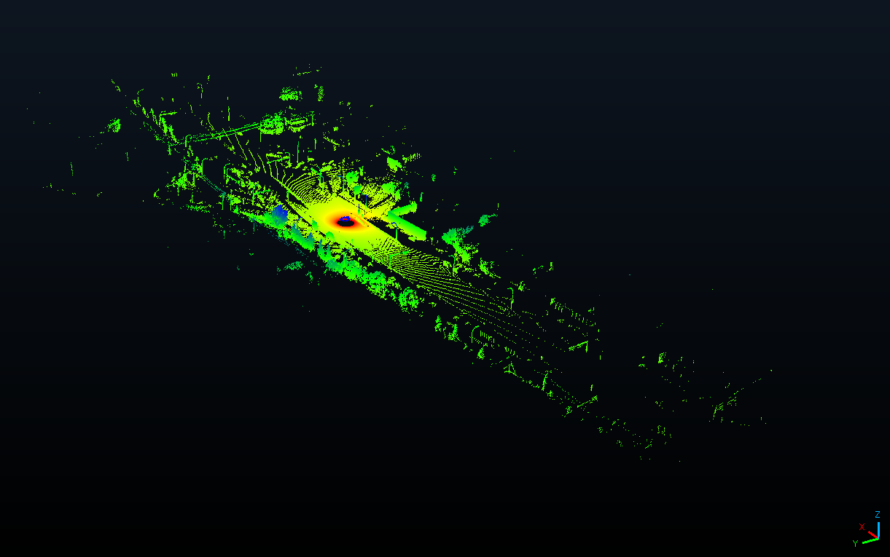
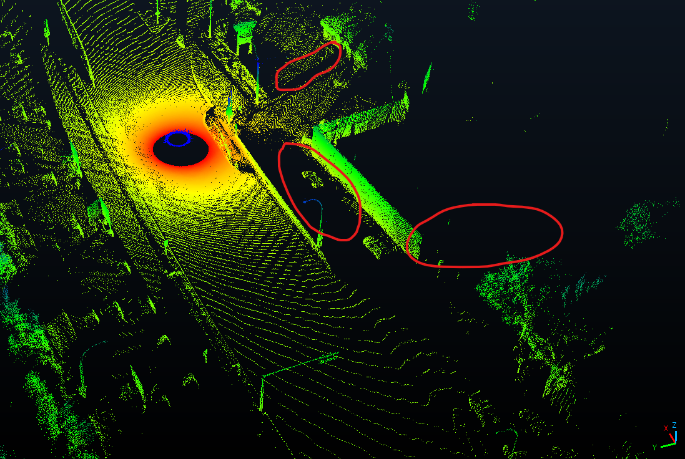
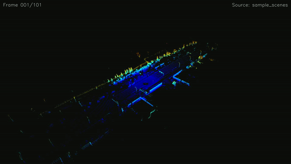

# General methodology for data rate analysis using the Vista simulator

## Overview

The Vista simulator takes an input point cloud, and simulates an autonomous vehicle as it 'drives' through the point cloud itself. This is a fork of the Vista simulator with features added on to calculate the data rate of a simulated AV.

### Process for generating Vista outputs

1. [Obtain trajectory](#trajectory)
2. [Segment the scene from the point cloud](#segmentation)
3. [Occlude the scene itself](#occlusion)

#### Trajectory

We can simulate the vehicle driving through the road through generating a trajectory that is manually determined from the input point cloud itself (see [here](Trajectory.md) for more info on the trajectory).

- The trajectory details the orientation, and position of the vehicle at a discrete interval of road points on the road itself.
  - We take 1 meter per point along the road; if a point cloud has 4000 points then it is 4km long.

#### Segmentation

At a road point, we will segment the entire point cloud down to the sensor FOV (points 'too far' from the sensor are ignored):
 within the FOV range (points in white) is then segmented")

- The sensor parameters here are from the ``velodyne_alpha_128.json`` sensor
configuration file, with parameters azimuth, elevation, vertical and horizontal resolution, and range. See [here](Sensorconfig.md) for information about the sensor configurations.

For this segmentation, we will perform a rigid body transformation on the point cloud itself to local coordinates (using the trajectory), and then simulate the LiDAR sensor on this transformed & segmented point cloud with the Vista simulator.

#### Occlusion

We use the Vista simulator to perform occlusion on our segmented point cloud. Occlusion is basically what points the sensor actually sees from its POV; points that are hidden behind points are occluded. See [here](Occlusion.md) for details about how Vista handles occlusions.

For example, think of a light post, and a world as a bunch of XYZ points. If you were to look at the light post, you won't be able to see anything behind the light post.

  
Now for an example, using a sample segmented, and occluded scene at 450m down the same road with the same sensor as above.

 Let's take a closer look at this scene.  Compared to the input point cloud, we can see that the barrier (behind the vehicle, indicated by the blue circle) is blocking the points from the input point cloud, leading to the void that is shown. We can also see the fact that points that make up the rear facing side of the building on the vehicle's right are not shown; it would make sense since the other points are occluding the back side. One more example of occlusion working is the light post blocking any points past it, circled in red on top.

### Analysis

After obtaining all of our output scenes for each road point, we can finally perform our analyses on the vehicle 'driving' down the road.

  
For visualization purposes, here is a replay of our autonomous vehicle driving down the road section for 100m.

*Think of each scene as a snapshot of what the vehicle sees as it drives down the road.*

 We want to analyze the data rate required to process the data seen by the sensor as the simulated AV moves through the road section; bascially obtain the data rate at each scene.

In order to do so, we need to voxelize each output scene, and perform our necessary calculations as needed. See [here](Analysis.md) for more information regarding the data rate calculations.
