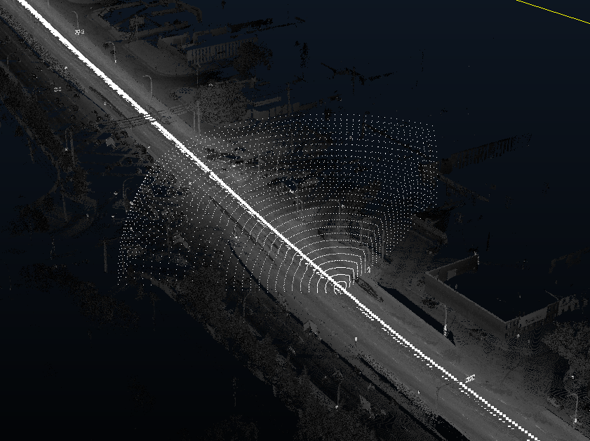

# Sensor configuration documentation

## Parameters

The results from our simulation heavily depend on the parameters of the sensor configuration for the simulated AV, as the ranges of the sensor directly influence how many points are segmented, and subsequently the data rate required.

Parameters include:

- ``numberSensors``: the number of sensors of the AV
- ``horizAngRes``: the angular resolution in the horizontal direction, given in degrees
- ``verticAngRes``: the angular resolution in the vertical direction, given in degrees
- ``e_low``: the lower bound of the sensor's vertical FOV in degrees
- ``e_high``: the upper bound of the sensor's vertical FOV in degrees
- ``a_low``: the lower bound of the sensor's horizontal FOV in degrees (CCW angle from forward vector, usually negative)
- ``a_high``: the upper bound of the sensor's horizontal FOV in degrees (CCW angle from leftward vector, usually positive)
- ``r_high``: the upper bound of the sensor's range, given in m
- ``r_low``: the lower bound of the sensor's range, given in m

The angular resolutions will determine the number of divisions of an angular range (lower and upper bounds), in a particular direction (elevation, azimuth)
In the example below, the angular resolutions affect the densities in each direction.

The ranges of elevation, azimuth, and range will form a 'solid'; think of it as the range that we sweep through as if we were performing integration in spherical coordinates.

Example of a sensor FOV, for sensor configuration ``tesla_night_maincamera.json``:

  ```json
  {
    "numberSensors": 1,
    "horizAngRes": 0.1,
    "verticAngRes": 0.1,
    "e_low": -60,
    "e_high": 30,
    "a_low": -60,
    "a_high": 60,
    "r_high": 60,
    "r_low": 0
  }
  ```

  
  *Here in this FOV, we have 60 degrees to the left and right of the forward direction, and -60 to 30 degrees along the vertical direction, with a total range of 0 to 60m. Sensor FOV points that are below the vehicle are ignored here.*

For multi-sensor configurations, the FOV points here would be overlapped for each sensor.
