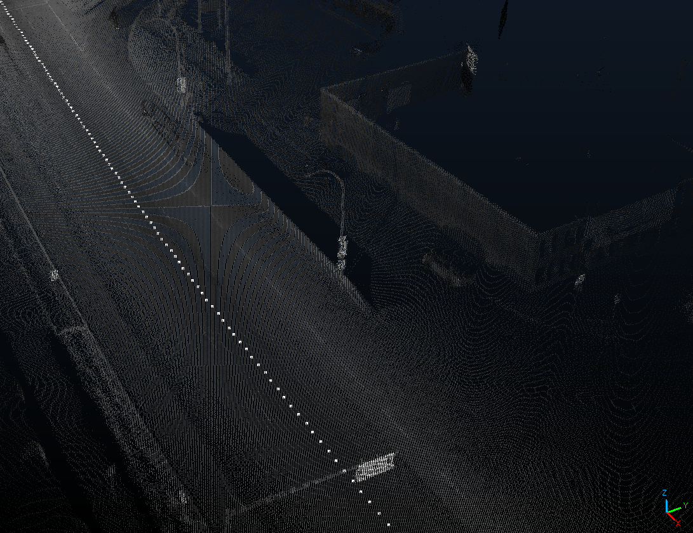
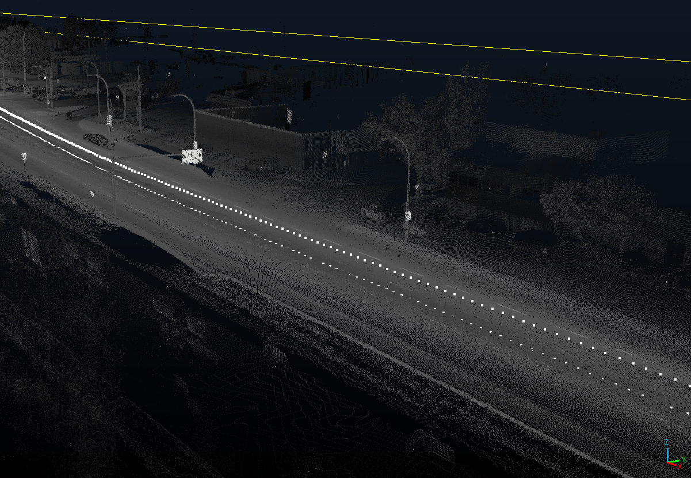

# Trajectory documentation

The trajectory is generated by fitting a least-squares parametric curve to all of the points that were directly below the scanning vehicle when the data was recorded.
From this curve, we then obtain the trajectory details, for each scene/road point:

- ``road_points``: The discrete interval of points spaced ``point_density`` m apart along the curve.
  - <details><summary>Example of road points:</summary>

    
  </details>

  - ``point_density`` is usually taken as 1.0.
- ``forwards``: The 3D unit vector in the forward direction, for each road point.
  - Determined by obtaining a window of 5 meters worth of road points in either direction, and taking the least squares slope over x, y, z for over this window.
- ``upwards``: The 3D unit vector in the upward direction, for each road point.
  - Determined by fitting a plane over the xyz points given by a ``floor_box_edge`` x ``floor_box_edge`` m slice of the road centered at the road point, and then finding the normal vector to this plane.
    - ``floor_box_edge`` is usually 2 meters
- ``leftwards``: The 3D unit vector in the leftwards direction, for each road point.
  - Determined by simply taking the crossw product of ``forwards`` and ``leftwards``.
- ``observer_points``: the road points, but shifted ``observer_height`` m upwards along the upwards vector to simulate the POV on a vehicle's roof (an observer)
  - ``observer_height`` is usually assumed to be 1.8m (the average height of a vehicle.)
  - <details><summary>Example of road, and observer points:</summary>

    

  </details>

## Usage

If you wish to generate a standalone trajectory with input from commandline arguments:

```bash
python gen_traj.py --observer_height {OBSERVER_HEIGHT} --input {PATH_TO_LAS}
```

Run the above command without any of the input flags if you wish to manually select the parameters. Note that ``observer_height`` will default to 1.2.

After generating the trajectory, ``road_points``, ``forwards``, ``upwards``, ``leftwards``, and ``observer_points`` will each be written to .csv files in ``vista/examples/Trajectory/{LASFILENAME}``.

### Usage in other Python scripts

If you wish to generate a trajectory from another script, ``gen_traj.py`` has callable methods that can be used. To do so, the methods must be called, in order (though it is advised to use file_tools to obtain already generated trajectories):

```python
import gen_traj

args = gen_traj.parse_cmdline_args() # Different than file_tools.parse_cmdline_args()!

las = gen_traj.open_las(verbose=True, args=args)
traj_config = gen_traj.config_trajectory(verbose=True, args=args, promptuser=False) # Not the trajectory itself
road_points, forwards, leftwards, upwards = gen_traj.generate_trajectory(verbose=True, las_obj=las, traj=traj_config)

# road_points, forwards, leftwards, upwards are all np.ndarrays of shape
# (N, 3), where N is the number of road points that were fit to the curve.
```
